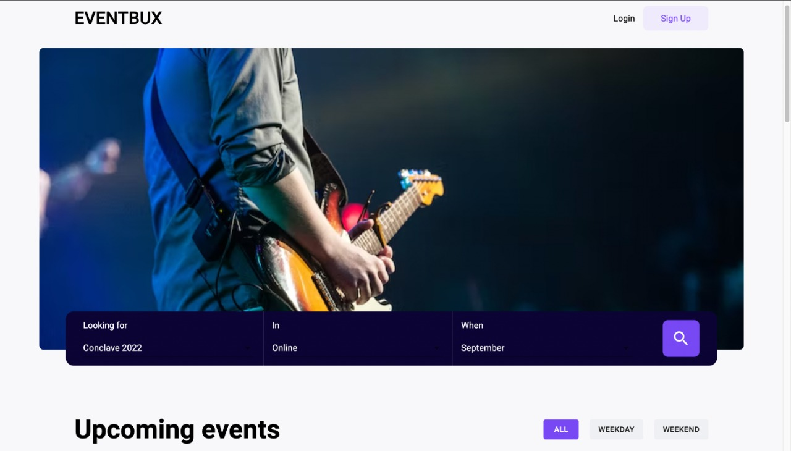
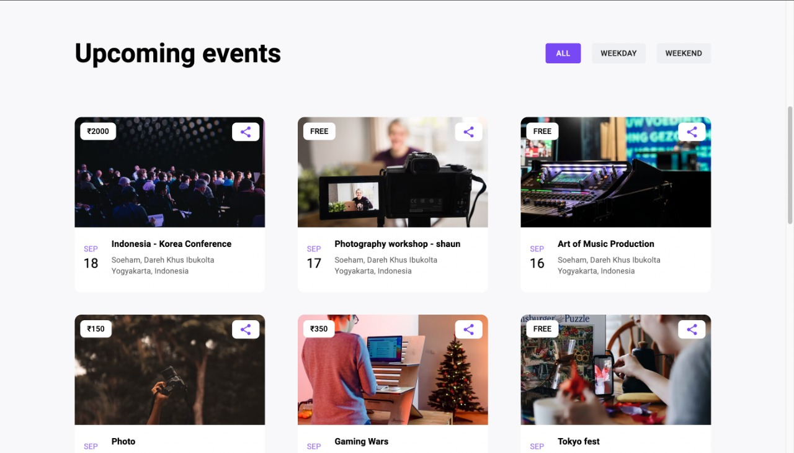
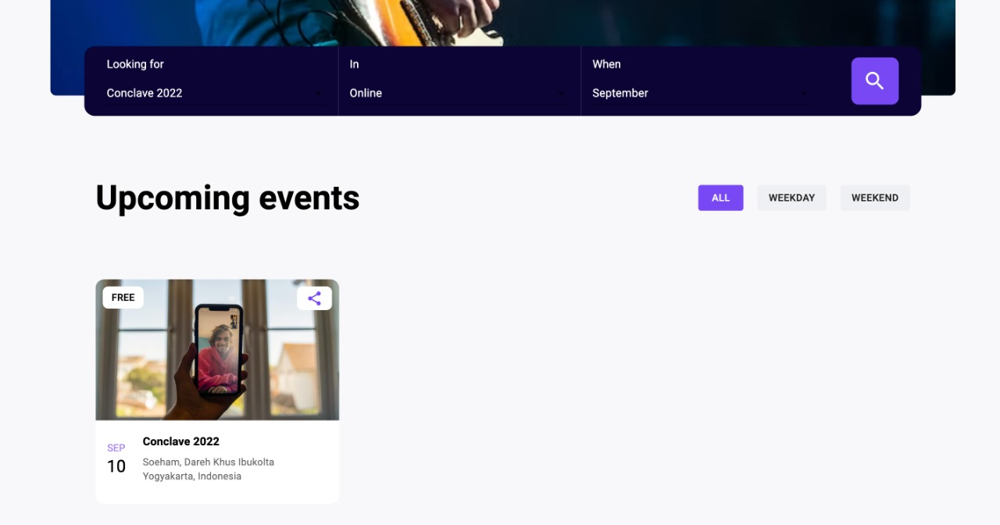

# EVENTBUX

* Eventbux in an event displaying website with search and filter options.
* Build on react , uses material UI and fetches data from custom JSON file.

## Demo
* Website link  - [website](https://dreamy-cheesecake-c14147.netlify.app/)






## Setup

This project requires ReactJS (version 16 or later) and NPM(6 or later) whch are really easy to install. To make sure you have them available on your machine, try running the following command.

```bash
  npm -v
```

clone the project locally

```bash
  git clone https://github.com/ruds18/dynamic-events.git
```

To install and set up the library, run:

```bash
   npm i 
```
Starting the app

```bash
   npm start
```
Yay! now you are all set ! 👍 . Search your favourite event...
